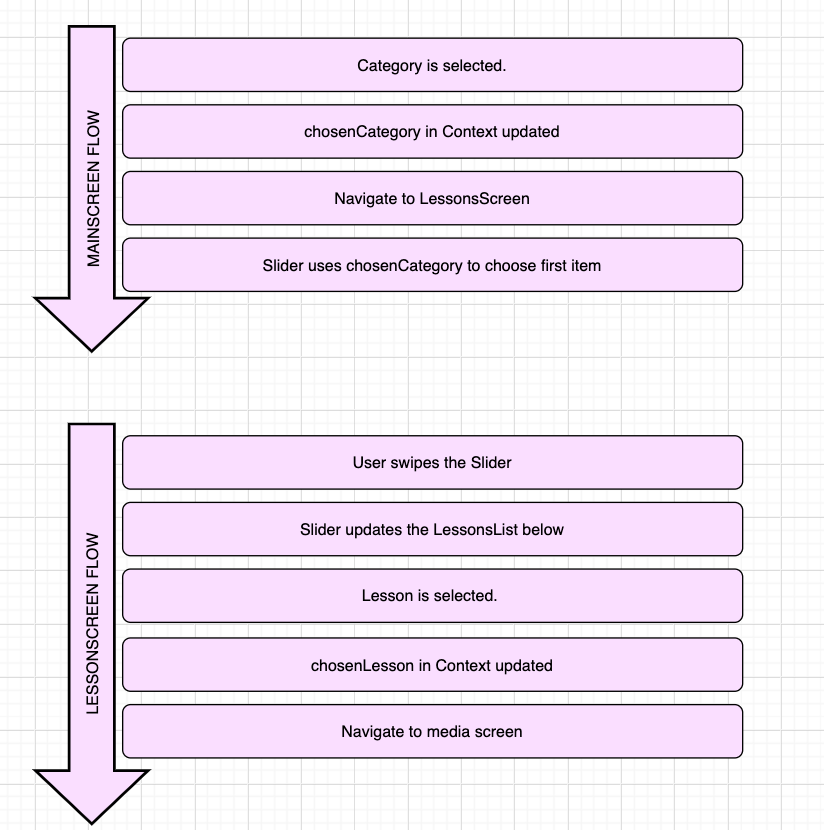

# MinunHetkeni_RN
Mobile application for Mindfullness. Built with React Native using Expo. Still a work in progress.

Technologies, libraries & concepts used:
React Native,
React Navigation 5.0, 
Functional components,
Hooks for managing the state of the program,
Media player,
Carousel with scrolling that updates the list below it.

To-do-list:
fix navigation,
enhance media player,
build back end

